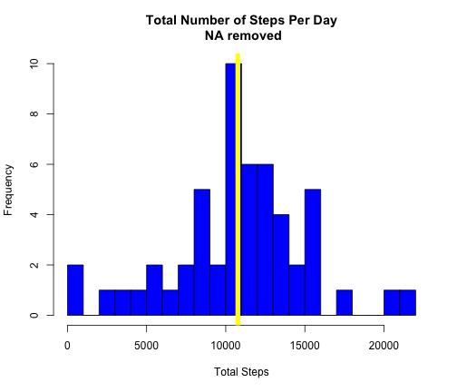
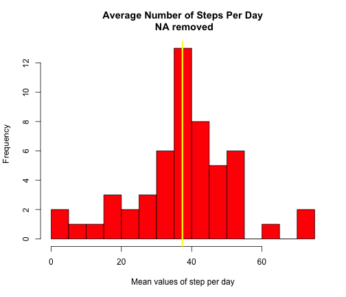
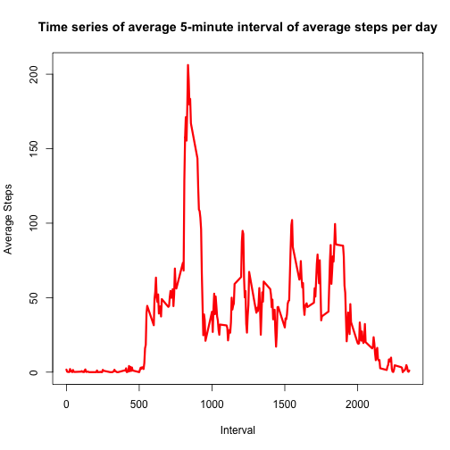
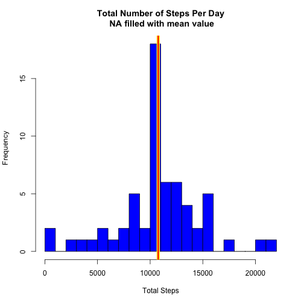
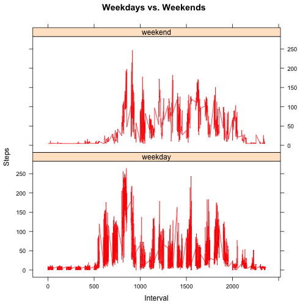

# *Reproducible Research: Peer Assesment 1*
#### *Denizhan EDEER*

You can find relevant Readme.Rmd file at [here](https://github.com/denizhanedeer/RepData_PeerAssessment1) for more information about the project.

###Load and Process Data

Activity data is downloaded and set at current working directory. You can also reach data from [here.](https://github.com/denizhanedeer/RepData_PeerAssessment1)


```r
activity12 <- read.csv("activity.csv",header = TRUE)
```

After we obtain data we need to figure out what is inside of it and do we need to reorginize or process anything. So we can use str(), head(), tail() built-in functions. 


```r
head(activity12)
```

```
##   steps       date interval
## 1    NA 2012-10-01        0
## 2    NA 2012-10-01        5
## 3    NA 2012-10-01       10
## 4    NA 2012-10-01       15
## 5    NA 2012-10-01       20
## 6    NA 2012-10-01       25
```

```r
tail(activity12)
```

```
##       steps       date interval
## 17563    NA 2012-11-30     2330
## 17564    NA 2012-11-30     2335
## 17565    NA 2012-11-30     2340
## 17566    NA 2012-11-30     2345
## 17567    NA 2012-11-30     2350
## 17568    NA 2012-11-30     2355
```

```r
str(activity12)
```

```
## 'data.frame':	17568 obs. of  3 variables:
##  $ steps   : int  NA NA NA NA NA NA NA NA NA NA ...
##  $ date    : Factor w/ 61 levels "2012-10-01","2012-10-02",..: 1 1 1 1 1 1 1 1 1 1 ...
##  $ interval: int  0 5 10 15 20 25 30 35 40 45 ...
```

As we see we have **NA's** at observations. It is nice to know how important and how much percent of data is missing. 

```r
mean(is.na(activity12$steps))
```

```
## [1] 0.1311475
```

So we know %13 percent of data missing and we would like to remove them. We have many options to achieve that with R but I would like to show complete.cases() function which removes all row from the data frame. So we can analyze only the days that we have "steps" observation. 

```r
activity <- activity12[complete.cases(activity12),]
mean(is.na(activity))
```

```
## [1] 0
```
Second step is dates. From the str() function result we check date is Factor. So we can change it to date format by as.Date() function. 

```r
activity$date <- as.Date(activity$date)
str(activity$date)
```

```
##  Date[1:15264], format: "2012-10-02" "2012-10-02" "2012-10-02" "2012-10-02" ...
```

###Mean Total Number of Steps Per Day

Our data is removed from missing values so we only need to iterate of the dates to find sum() or mean() of the steps. We can acheive it with tapply function or aggregate function from stats library.

```r
library(stats)
total_steps <- aggregate(activity$steps,by=list(activity$date),FUN=sum)
## it is nice to set col names after aggregation. 
names(total_steps) <- c("date","sum_of_steps")
## now we take mean of steps
mean_steps <- aggregate(activity$steps,by=list(activity$date),FUN=mean)
names(mean_steps) <- c("date","mean_of_steps")
```
Just check what we have

```r
head(total_steps)
```

```
##         date sum_of_steps
## 1 2012-10-02          126
## 2 2012-10-03        11352
## 3 2012-10-04        12116
## 4 2012-10-05        13294
## 5 2012-10-06        15420
## 6 2012-10-07        11015
```

```r
head(mean_steps)
```

```
##         date mean_of_steps
## 1 2012-10-02       0.43750
## 2 2012-10-03      39.41667
## 3 2012-10-04      42.06944
## 4 2012-10-05      46.15972
## 5 2012-10-06      53.54167
## 6 2012-10-07      38.24653
```
Time to show total number of steps per day as diagram:

```r
hist(total_steps$sum_of_steps,breaks=20,col="blue",xlab="Total Steps",main="Total Number of Steps Per Day\n NA removed")
abline(v=mean(total_steps$sum_of_steps),lwd=7,col="yellow")
```

 
Mean of steps per day with median value as vertical line

```r
hist(mean_steps$mean_of_steps,breaks=20,col="red",xlab="Mean values of step per day",main="Average Number of Steps Per Day\n NA removed")
abline(v=median(mean_steps$mean_of_steps),col="yellow",lwd=3)
```

 
### Average Daily Activity Pattern

Our **activity** dataset has 3 variables. Steps, date, interval. Interval is a variable that every value exists for every date. Just visualize:

```r
test_interval <- activity[activity$interval == 15,]
head(test_interval,10)
```

```
##      steps       date interval
## 292      0 2012-10-02       15
## 580      0 2012-10-03       15
## 868      0 2012-10-04       15
## 1156     0 2012-10-05       15
## 1444     0 2012-10-06       15
## 1732     0 2012-10-07       15
## 2308     0 2012-10-09       15
## 2596     0 2012-10-10       15
## 2884     8 2012-10-11       15
## 3172     0 2012-10-12       15
```

```r
mean(test_interval$steps)
```

```
## [1] 0.1509434
```
Example above shows us every interval observation value exist for all dates and steps vector so we need to iterate over all interval values corresponding steps vector. 


```r
mean_int_data <- aggregate(activity$steps, by=list(activity$interval),FUN=mean)
names(mean_int_data) <- c("interval","mean_of_steps")
head(mean_int_data,10)
```

```
##    interval mean_of_steps
## 1         0     1.7169811
## 2         5     0.3396226
## 3        10     0.1320755
## 4        15     0.1509434
## 5        20     0.0754717
## 6        25     2.0943396
## 7        30     0.5283019
## 8        35     0.8679245
## 9        40     0.0000000
## 10       45     1.4716981
```

```r
with(mean_int_data,plot(interval,mean_of_steps,type="l",col="red",xlab="Interval",ylab="Average Steps",lwd=3,main="Time series of average 5-minute interval of average steps per day"))
```

 

Interval that has maximum steps:

```r
max_interval <- mean_int_data$interval[mean_int_data$mean_of_steps == max(mean_int_data$mean_of_steps)]
max_interval
```

```
## [1] 835
```

###Imputing Missing Values

So far we worked with dataset called **activity**. But we cleared all the __NA__ values from original data set. So we are swicthing back to **activity12**. First of all we know that %13 percent of the data was missing. But we need to find exact number of missing rows. 

```r
total_NA <- sum(is.na(activity12$steps))
```
Total number of missing value is **2304.** 

For replacing missing values with test values we need to define new observation values for steps variable. 

```r
# Which observations are missing
row_NA <- which(is.na(activity12$steps))

new_value <- rep(mean(activity12$steps,na.rm=TRUE),length(row_NA))

head(row_NA)
```

```
## [1] 1 2 3 4 5 6
```

```r
head(new_value)
```

```
## [1] 37.3826 37.3826 37.3826 37.3826 37.3826 37.3826
```
So we will replace __NA__ values with **37.3825996.** row_NA is a vector that shows missing value positions.

```r
activity12[row_NA,"steps"] <- new_value
head(activity12,15)
```

```
##      steps       date interval
## 1  37.3826 2012-10-01        0
## 2  37.3826 2012-10-01        5
## 3  37.3826 2012-10-01       10
## 4  37.3826 2012-10-01       15
## 5  37.3826 2012-10-01       20
## 6  37.3826 2012-10-01       25
## 7  37.3826 2012-10-01       30
## 8  37.3826 2012-10-01       35
## 9  37.3826 2012-10-01       40
## 10 37.3826 2012-10-01       45
## 11 37.3826 2012-10-01       50
## 12 37.3826 2012-10-01       55
## 13 37.3826 2012-10-01      100
## 14 37.3826 2012-10-01      105
## 15 37.3826 2012-10-01      110
```

```r
sum(is.na(activity12))
```

```
## [1] 0
```

```r
str(activity12)
```

```
## 'data.frame':	17568 obs. of  3 variables:
##  $ steps   : num  37.4 37.4 37.4 37.4 37.4 ...
##  $ date    : Factor w/ 61 levels "2012-10-01","2012-10-02",..: 1 1 1 1 1 1 1 1 1 1 ...
##  $ interval: int  0 5 10 15 20 25 30 35 40 45 ...
```
So we can follow up the same steps we did above with aggregate() function and hist().

```r
total_steps12 <- aggregate(activity12$steps,by=list(activity12$date),FUN=sum)
## it is nice to set col names after aggregation. 
names(total_steps12) <- c("date","sum_of_steps")
hist(total_steps12$sum_of_steps,breaks=20,col="blue",xlab="Total Steps",main="Total Number of Steps Per Day\n NA filled with mean value")
mean12 <- mean(total_steps12$sum_of_steps)
median12 <- mean(total_steps12$sum_of_steps)
abline(v=mean12,lwd=7,col="yellow")
abline(v=median12,lwd=3,col="red")
```

 

```r
mean12
```

```
## [1] 10766.19
```

```r
median12
```

```
## [1] 10766.19
```

###Difference Betweem Weekdays and Weekends

We are going to use weekdays() function to add weekdays based on date variable. 


```r
activity12$weekday <- weekdays(as.Date(activity12$date))
activity12$weekday.type <- factor(ifelse(activity12$weekday == "Sunday" | activity12$weekday == "Saturday","weekend","weekday"),levels=c("weekday","weekend"))
head(activity12,10)
```

```
##      steps       date interval weekday weekday.type
## 1  37.3826 2012-10-01        0  Monday      weekday
## 2  37.3826 2012-10-01        5  Monday      weekday
## 3  37.3826 2012-10-01       10  Monday      weekday
## 4  37.3826 2012-10-01       15  Monday      weekday
## 5  37.3826 2012-10-01       20  Monday      weekday
## 6  37.3826 2012-10-01       25  Monday      weekday
## 7  37.3826 2012-10-01       30  Monday      weekday
## 8  37.3826 2012-10-01       35  Monday      weekday
## 9  37.3826 2012-10-01       40  Monday      weekday
## 10 37.3826 2012-10-01       45  Monday      weekday
```

```r
tail(activity12,10)
```

```
##         steps       date interval weekday weekday.type
## 17559 37.3826 2012-11-30     2310  Friday      weekday
## 17560 37.3826 2012-11-30     2315  Friday      weekday
## 17561 37.3826 2012-11-30     2320  Friday      weekday
## 17562 37.3826 2012-11-30     2325  Friday      weekday
## 17563 37.3826 2012-11-30     2330  Friday      weekday
## 17564 37.3826 2012-11-30     2335  Friday      weekday
## 17565 37.3826 2012-11-30     2340  Friday      weekday
## 17566 37.3826 2012-11-30     2345  Friday      weekday
## 17567 37.3826 2012-11-30     2350  Friday      weekday
## 17568 37.3826 2012-11-30     2355  Friday      weekday
```

We created a new dataset now we are going to make a panel plot for it.

```r
# we need to calculate average of steps per weekday
mean_act12 <- aggregate(activity12$steps,by=list(activity12$weekday.type,activity12$weekday, activity12$interval), FUN=mean)
names(mean_act12) <- c("type","weekday","interval","mean_of_steps")
head(mean_act12)
```

```
##      type  weekday interval mean_of_steps
## 1 weekday   Friday        0      8.307244
## 2 weekday   Monday        0      9.418355
## 3 weekend Saturday        0      4.672825
## 4 weekend   Sunday        0      4.672825
## 5 weekday Thursday        0      9.375844
## 6 weekday  Tuesday        0      0.000000
```

```r
library(ggplot2)
library(lattice)
xyplot(mean_of_steps ~ interval | type,data=mean_act12,type ="l",layout=c(1,2),col="red",ylab="Steps",xlab="Interval",main="Weekdays vs. Weekends")
```

 

